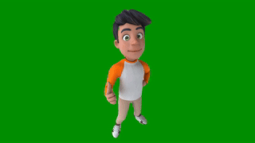

# AI Powered Video Background Removal Tool

[](https://github.com/killian31/VideoBackgroundRemoval/stargazers)
[](https://github.com/killian31/VideoBackgroundRemoval/actions/workflows/github-actions-black-formatting.yml)
[](https://wakatime.com/badge/github/killian31/VideoBackgroundRemoval)

The Video Background Removal Tool is designed to enable users to effortlessly remove backgrounds from videos by selecting a subject in a single frame. This powerful tool is optimized to run on CPUs and boasts a user-friendly interface, making it ideal for a wide range of users, especially online content creators like YouTubers.

<p align="center">
  <table>
    <tr>
      <td>
        
      </td>
      <td>
        
      </td>
    </tr>
  </table>
</p>

## Contents

Table of contents:

- [State of development](#how-it-works-and-state-of-development)
- [Installation](#installation)
- [Usage](#usage)
- [Example](#example)
- [Contribution](#how-to-contribute)

## How it works and state of development

- [x] **Initial Selection**: Users draw a bounding box around the desired character in the first frame of the video. Current state: user gives a bounding box as a txt file.
- [x] **Processing**: The tool then processes the video, tracking and isolating the selected subject in all subsequent frames.
- [x] **Output**: The final output is a sequence of the selected subject rendered against a green screen, suitable for further video editing and composition.

## Installation

```bash
git clone https://github.com/killian31/VideoBackgroundRemoval.git
cd VideoBackgroundRemoval
pip install -r requirements.txt --upgrade
```

## Usage

### Using the Streamlit app (locally)

Run `streamlit run app.py` to launch the Streamlit app. Then, upload a video, draw a
bounding box around what you want to remove the background from, using the sliders,
and click on Segment Video.

### Command line

```bash
usage: main.py [-h] [--video_filename VIDEO_FILENAME] [--dir_frames DIR_FRAMES] [--image_start IMAGE_START] [--image_end IMAGE_END] [--bbox_file BBOX_FILE]
               [--skip_vid2im] [--mobile_sam_weights MOBILE_SAM_WEIGHTS] [--output_dir OUTPUT_DIR] [--output_video OUTPUT_VIDEO]

options:
  -h, --help            show this help message and exit
  --video_filename VIDEO_FILENAME
                        path to the video
  --dir_frames DIR_FRAMES
                        path to the directory in which all input frames will be stored
  --image_start IMAGE_START
                        first image to be stored
  --image_end IMAGE_END
                        last image to be stored, last one if 0
  --bbox_file BBOX_FILE
                        path to the bounding box text file
  --skip_vid2im         whether to write the video frames as images
  --mobile_sam_weights MOBILE_SAM_WEIGHTS
                        path to MobileSAM weights
  --output_dir OUTPUT_DIR
                        directory to store the output frames
  --output_video OUTPUT_VIDEO
                        path to store the output video
```

## Example

The following command line is a working example from a video stored in the repo:

```bash
python3 main.py --video_filename assets/example.mp4 --dir_frames ./frames --bbox_file bbox.txt --mobile_sam_weights models/mobile_sam.pt --output_dir output_frames --output_video output.mp4
```

## How to Contribute

We welcome contributions from the community! To ensure a consistent code style, we ask contributors to follow these guidelines:

### Code Format

Please format your code using the `black` code formatter.

#### Installation

```bash
pip install black
```

#### Usage

To format your code:

```bash
black .
```

This setup will help maintain a consistent coding style throughout the project.
